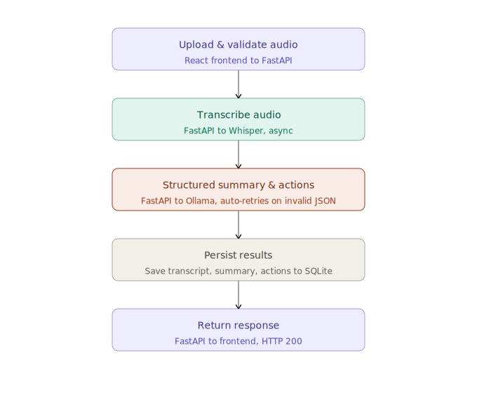
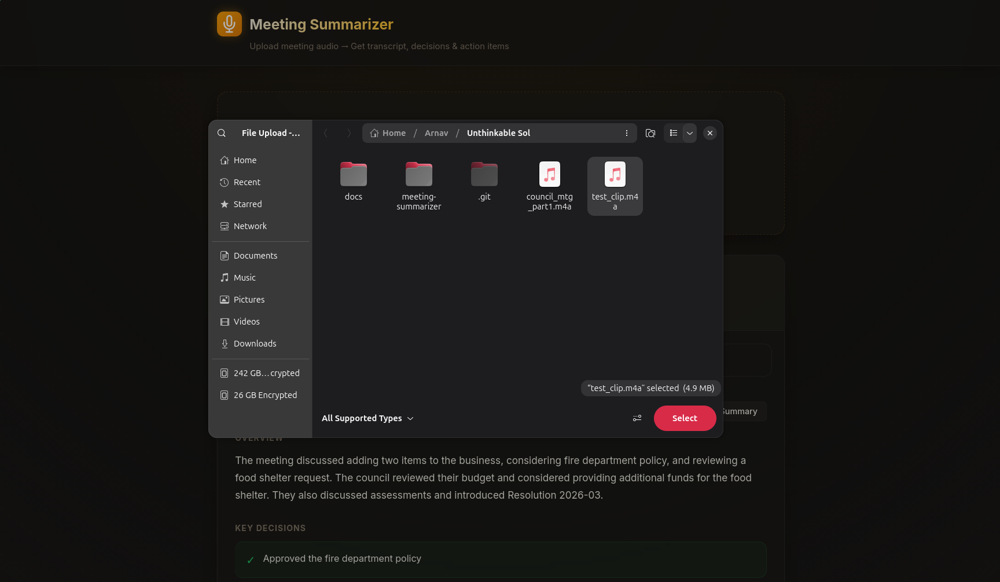
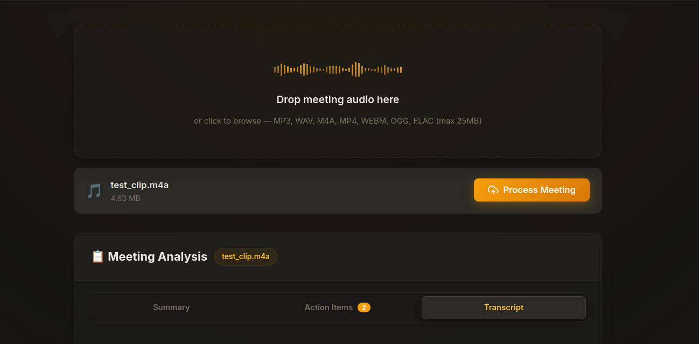
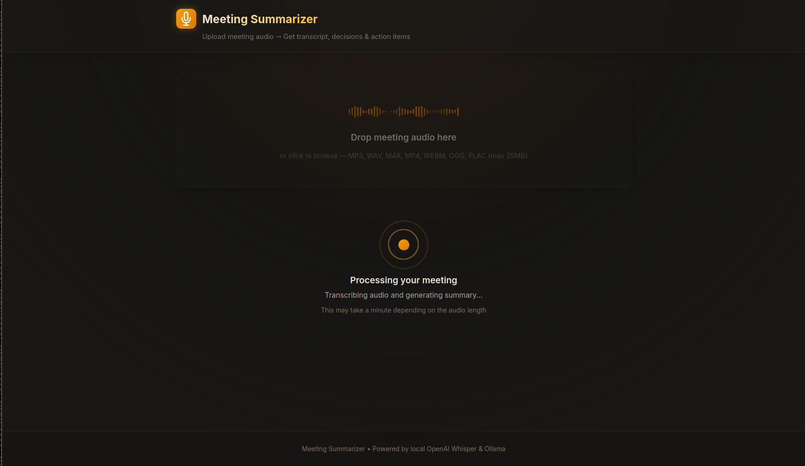
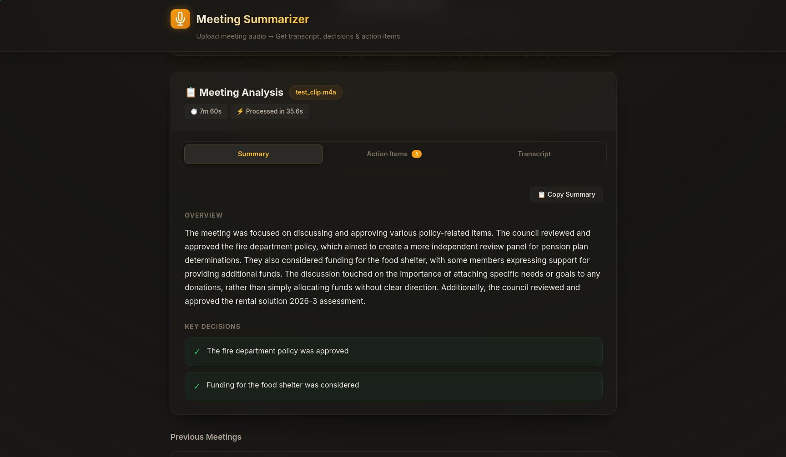
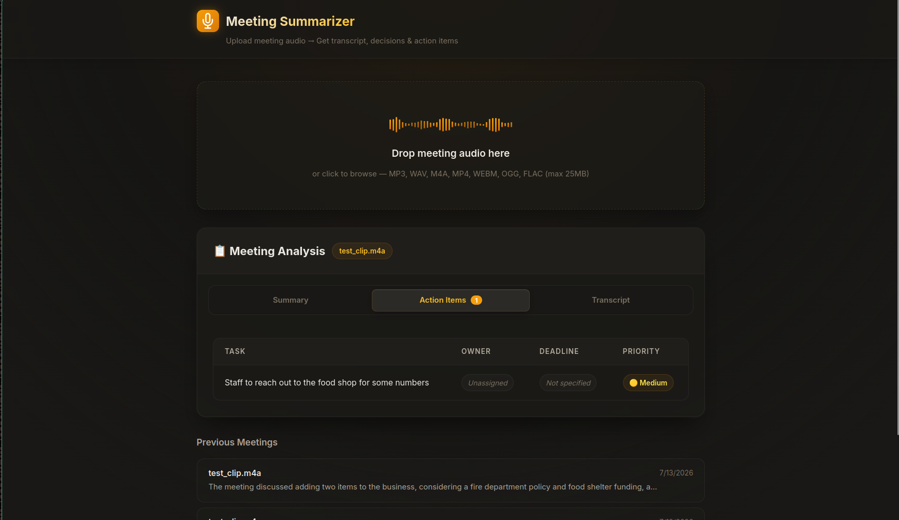
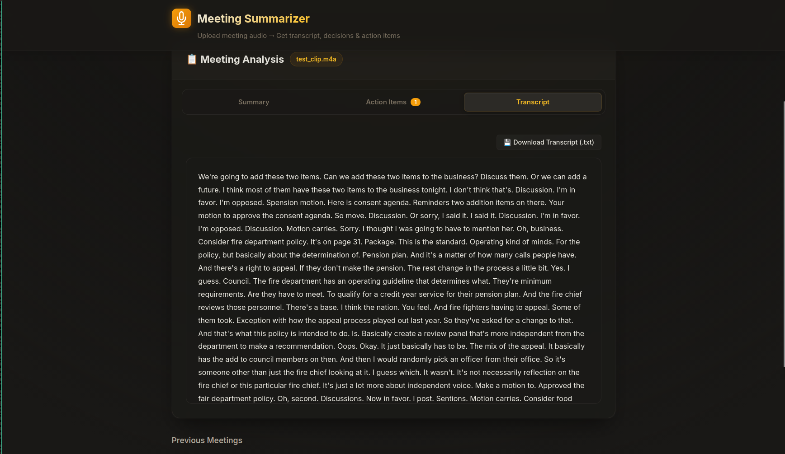
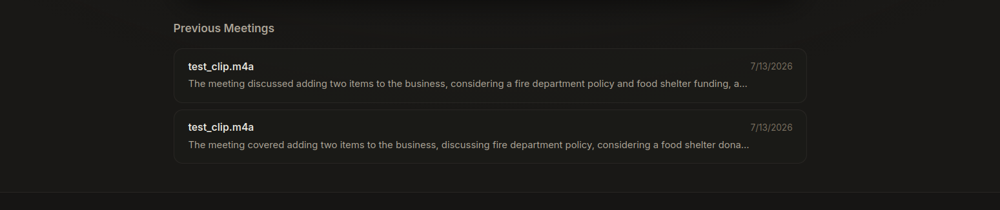

# 🎙️ Meeting Summarizer

A high-performance, local-first, zero-cost web application that transcribes meeting audio files and generates structured, action-oriented summaries, decision logs, and prioritized action items.

---

## 🌟 Key Features

- **Local & Zero-Cost**: Powered entirely by local models (`openai-whisper` and `ollama`). No API keys, no paywalls, no external data leakage.
- **Waveform Animation**: Interactive, active audio waveform animation in the upload zone simulating live recording.
- **Claude-style Warm Dark Theme**: A premium UI color scheme utilizing warm espresso backgrounds (`#191816`) paired with vibrant amber/orange accents.
- **Prompt v2.0 (Few-Shot & Self-Correcting)**: High-reliability structured extraction featuring 2-tier self-correction retry loops and context window truncation protection.
- **Priority-Coded Action Items**: Extracted action items automatically categorized by priority (`🔴 High`, `🟡 Medium`, `🟢 Low`) with assignees and deadlines.
- **Meeting Type Categorization**: Automatic meeting classification (`standup`, `planning`, `retrospective`, etc.) displayed as metadata badges.
- **Tabbed Analysis & History**: Interactive navigation between overview, action items table, and full transcript, alongside a persistent sidebar of past meetings.

---

## 🏗️ System Architecture



---

## 🎬 Video Demo

Watch the full end-to-end walk-through and features demonstration of the application on Google Drive:

[](https://drive.google.com/file/d/1puWsmg0EJK_vghg8HxK2OlRrCOGW-I-H/view?usp=sharing)

👉 **[Watch the Meeting Summarizer Demo Video on Google Drive](https://drive.google.com/file/d/1puWsmg0EJK_vghg8HxK2OlRrCOGW-I-H/view?usp=sharing)**

---

## 📸 Visual Walkthrough

### 1. Upload & Initial State
We start at the main landing page, which loads our historical meeting summaries from SQLite. We can then trigger a new upload via the dropzone.

| 1. Landing Page & History | 2. File Selection / Dropzone |
| :---: | :---: |
|  |  |

### 2. The Processing Pipeline
Once a file is selected, it goes through a progress flow:
*   **Uploading**: The raw audio file is sent to the FastAPI backend.
*   **Transcription & Summarization**: The backend processes the audio with Whisper (STT) and Llama 3 (LLM) asynchronously while showing a progress loader.

| 3. Transcribing & Summarizing |
| :---: |
|  |

### 3. Structured Meeting Results
Once processing completes, the frontend renders the full transcript, structured summaries, key decisions, and priority-coded action items with assignees and deadlines.

| 4. Summary & Decisions | 5. Action Items Table |
| :---: | :---: |
|  |  |

| 6. Segmented Transcript | 7. History Selection |
| :---: | :---: |
|  |  |

---

## 🛠️ Tech Stack & Models

### Core Technologies
- **Frontend**: React (Vite), HTML5, Vanilla CSS custom design system (custom variables, fluid layouts, responsive breakpoints).
- **Backend**: FastAPI (Python 3.10+), Uvicorn ASGI server.
- **Database**: SQLite (managed connection pool, serialized JSON columns).

### Local Models Used
1. **Transcription (STT)**: **OpenAI Whisper (base)**
   - Lazy-loaded once globally as a singleton (avoids cold-start delays on subsequent requests).
   - Smart device detection: Runs on **NVIDIA CUDA** for hardware acceleration, with automated, graceful fallback to **CPU** if CUDA is unavailable or VRAM is exhausted.
   - Run inside an async `ThreadPoolExecutor` to keep the FastAPI event loop fully unblocked.
2. **Summarization (LLM)**: **Ollama (`llama3:8b`)**
   - Configured via local model endpoints (`http://localhost:11434/v1`).
   - Standardized on an OpenAI-compatible completion schema.

---

## 📝 Prompt Engineering (Prompt v2.0)

To achieve maximum reliability with local models (which typically lack the formatting adherence of GPT-4), we implemented **Prompt v2.0** in `app/services/summarization.py`:

- **Role Priming**: The LLM is initialized as a `"professional meeting analyst"` with structural framing guidelines.
- **Few-Shot Learning Examples**: Includes an inline example of a raw transcript alongside its perfect target JSON format. This forces models like `llama3:8b` to maintain structural consistency.
- **Output Format Constraints**: Explicitly instructs the LLM to return **valid JSON only** without markdown code fences or conversational text.
- **Anti-Hallucination Guardrails**: Mandates that the LLM only extract explicitly stated or strongly implied details, setting default values (`"Unassigned"`, `"Not specified"`) for missing attributes.
- **Context Window Protection**: Inputs are dynamically checked and truncated at `16,000 characters` (~4,000 tokens) to ensure the prompt never exceeds the context limits of local models.
- **Self-Correction Retry Loop**: If the LLM returns invalid JSON:
  1. The server catches the exception.
  2. A second prompt is generated including the failed response and explicit instructions to repair the syntax.
  3. The temperature is dropped from `0.3` to `0.1` to maximize format adherence.
  4. Graceful fallback ensures that even on consecutive failures, the raw text is preserved for the user without causing an API crash.

---

## 🚀 Setup & Execution Guide

### Prerequisites
- **Python 3.10+**
- **Node.js 18+** and `npm`
- **Ollama** installed on your host machine ([Download Ollama](https://ollama.com))

---

### Step 1: Initialize Ollama & Pull Model
Before launching the backend, ensure the local Ollama instance is active and the model is pulled:
```bash
# Start Ollama service (usually runs automatically as a system daemon)
# On Linux/macOS:
ollama serve

# Pull the llama3:8b model (required for summarization)
ollama pull llama3:8b
```

---

### Step 2: Configure Environment Variables
Copy the environment template from the root folder:
```bash
# From the root directory:
cp meeting-summarizer/.env.example meeting-summarizer/backend/.env
```
*Note: Since the system is designed to run locally, you do not need to configure `OPENAI_API_KEY` or `OPENROUTER_API_KEY` unless you want to transition to cloud mode.*

---

### Step 3: Run the FastAPI Backend
```bash
cd meeting-summarizer/backend

# Initialize virtual environment
python -m venv venv
source venv/bin/activate  # On Windows: venv\Scripts\activate

# Install dependencies (includes Whisper, PyTorch, FastAPI, etc.)
pip install -r requirements.txt

# Start the server on port 8000
uvicorn app.main:app --reload --port 8000
```
Verify the backend is healthy by navigating to `http://localhost:8000/api/health` in your browser.

---

### Step 4: Run the Vite React Frontend
```bash
cd ../frontend

# Install node dependencies
npm install

# Start the development server
npm run dev
```
Open `http://localhost:5173` to interact with the application.

---

## 🔍 Evaluation Focus & Implementation Details

To align with the core evaluation criteria, the codebase implements the following technical measures:

### 1. Transcription Accuracy
- **Model Choice**: Standardized on local `openai-whisper` (base configuration) to achieve balanced latency and transcription accuracy metrics.
- **Resource Management**: Whisper is lazily loaded as a singleton on first request to minimize runtime memory footprint.
- **Event Loop Safety**: Transcription tasks run inside a separate thread pool (`ThreadPoolExecutor`), ensuring the FastAPI server remains responsive under concurrent operations.
- **Hardware Acceleration**: Automatic checks assign computation to CUDA GPUs when available, falling back gracefully to CPU if hardware acceleration is unsupported.

### 2. Summary Quality
- **Type Safety**: Pydantic models (`MeetingSummary`, `ActionItem`) enforce strict database and API contracts.
- **Data Completeness**: Default values (e.g., `"Unassigned"` and `"Not specified"`) prevent null exceptions on missing meeting metadata.
- **Resilience**: The system tolerates formatting errors from smaller local models via a 2-tier parser structure.

### 3. LLM Prompt Effectiveness
- **Formatting Guarantees**: Prompt v2.0 utilizes structured few-shot examples inline to guide formatting.
- **Self-Correction Loops**: Automatic retry handlers evaluate outputs, feeding syntax errors back to the model with context to repair formatting failures.
- **Context Limits**: Built-in character-level truncation checks restrict input sizes to prevent context window overload.

### 4. Code Structure
- **Modularity**: Decoupled routes, services, models, database layer, and environment-driven configurations.
- **Robust Schema Migrations**: SQLite schema initialization checks automatically verify and migrate column updates (such as `meeting_type`) on database startup without manual user intervention.

---

## 📂 Project Structure

```
Unthinkable_Sol/
├── meeting-summarizer/
│   ├── backend/
│   │   ├── app/
│   │   │   ├── main.py              # FastAPI app configuration & CORS setup
│   │   │   ├── config.py            # Pydantic Settings wrapper
│   │   │   ├── models.py            # API request/response schemas
│   │   │   ├── database.py          # SQLite connection manager & migrations
│   │   │   ├── routes/
│   │   │   │   └── meetings.py      # Upload and retrieval route controllers
│   │   │   └── services/
│   │   │       ├── transcription.py # Local Whisper inference wrapper
│   │   │       └── summarization.py # Ollama completion API & Prompt v2.0
│   │   └── requirements.txt         # Backend Python dependencies
│   ├── frontend/
│   │   ├── src/
│   │   │   ├── App.jsx              # Application layout & state root
│   │   │   ├── index.css            # Global CSS variables & keyframe animations
│   │   │   ├── components/
│   │   │   │   ├── FileUpload.jsx   # Waveform drag-and-drop audio portal
│   │   │   │   ├── MeetingResult.jsx# Tab navigation & meeting overview
│   │   │   │   ├── ActionItems.jsx  # Prioritized tasks data table
│   │   │   │   ├── MeetingHistory.jsx# Sidebar log of past transcriptions
│   │   │   │   └── Loader.jsx       # Custom CSS processing component
│   │   │   └── api/
│   │   │       └── client.js        # Axios/Fetch API client wrapping
│   │   └── package.json             # Frontend dependency package definition
│   ├── .env.example                 # Configuration blueprint
│   └── README.md                    # Subfolder README backup
└── README.md                        # Project root documentation (this file)
```
